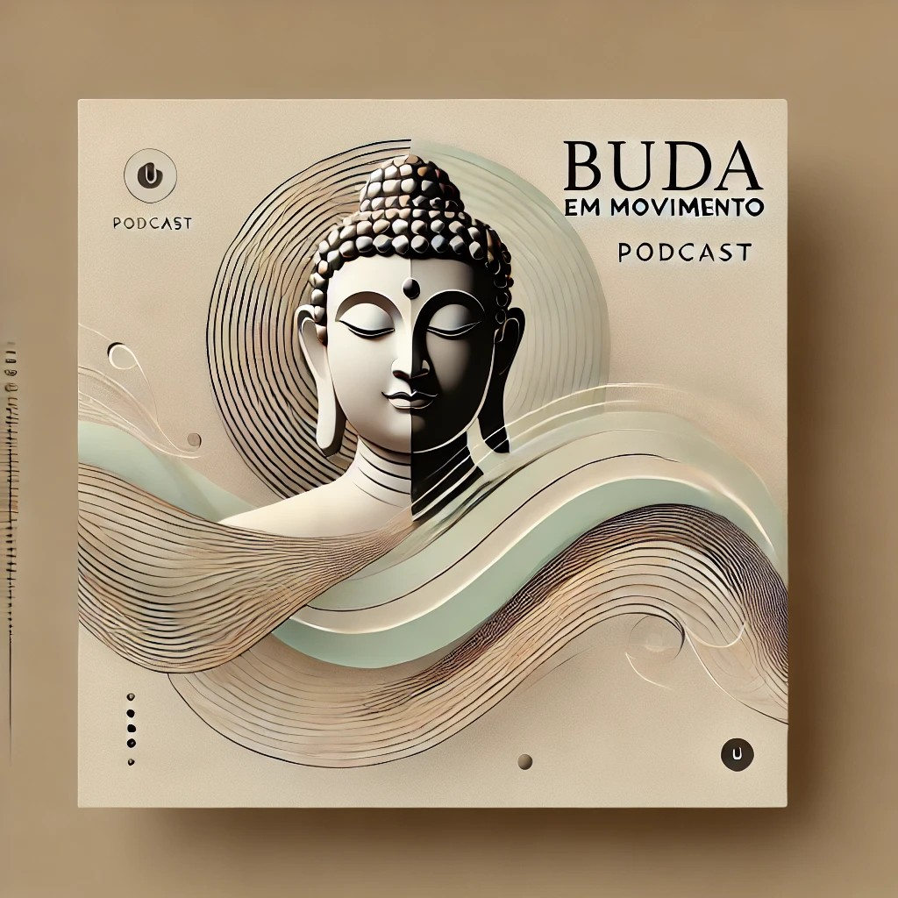

-------

# Projeto Prompts-for-podcast-generate-by-ia

 > ℹ️ **NOTE:** Este é o repositório desenvolvido durante o curso no qual fui aluna na plataforma da [DIO](https://dio.me)

Projeto com o objetivo de gerar um podcast com as facilidades das ferramentas de IA. todos os prompts seguem abaixo.

<a href="https://github.com/ClaudiaPocone/prompts-for-podcast-generate-by-ia/blob/main/output/2024_12_25_20_13_59.mp3" title="Ouça Podcast now"> 📕Clique aqui para ouvir</a>

## 💻 Tecnologias utilizadas no projeto

- [ChatGPT](https://chat.openai.com/) 
- [Elevenlabs.io]( https://elevenlabs.io/app/home)

## 🧠 Prompts

ChatGPT：

|   Ação   | prompt                                                                                                                                                                                                                                                                         |
| :------: | ------------------------------------------------------------------------------------------------------------------------------------------------------------------------------------------------------------------------------------------------------------------------------ |
|  título  | Você é um roteirista de podcast, e vamos criar um podcast de psicologia, focado em equilíbrio emocional e eu gostaria de uma ajuda sua para criar 5 sugestões de nomes criativos para um podcast de equilíbrio emocional feito por psicólogos, e que tenha algum trocadilho cult no nome

O podcast vai falar sobre dicas e teorias sobre a literatura acadêmica sobre equilíbrio emocional e o que está acontecendo no mundo acadêmico 

{REGRAS}

O nome deve ser enxuto, um nome e um subtítulo
O nome tenha algum trocadilho cult com nomes de personalidades conhecidas como Buda, Gandhi ou outro que personifique equilíbrio emocional.
O nome deve conter alguma palavra forte que remeta a equilíbrio emocional
{REGRAS NEGATIVAS}

Não quero que o título contenha palavras em inglês
Não quero que utilize nenhuma das palavras nessa lista: Psicologia, Controle, Equilíbrio Emocional |

| conteúdo | Agora, Você é um roteirista de podcast, e vamos criar um roteiro de um podcast de psicologia, focado em equilíbrio emocional cujo o nome é "Buda em Movimento - Diálogos sobre a arte de manter a calma em tempos instáveis" e tem foco em equilíbrio emocional, com o público alvo de pessoas leigas interessadas em aplicabilidade de dicas e teorias de psicologia como subsídio para viverem melhor suas próprias vidas cotidianas e seus relacionamentos 

o formato do roteiro deve ser [INTRODUÇÃO] [CURIOSIDADE 1] [CURIOSIDADE 2] [FINALIZAÇÃO]

{REGRAS}

no bloco [INTRODUÇÃO] substitua por uma introdução iguais as introduções dos vídeos do canal 'Psicologia na Prática', como se fossem escritos pelo Alana Anijar. Não cite o nome do podcast 'Psicologia na Prática ' nem cite o nome Alana Anijar. Pode citar o nome Claudia Poconé 
no bloco [CURIOSIDADE 1] substitua por uma curiosidade de Buda e a instabilidade e efemeridade da vida
no bloco [CURIOSIDADE 2] sobre dicas como podemos utilizar o conhecimento trazido no bloco [CURIOSIDADE 1] para conseguir e manter o equilíbrio emocional 
no bloco [FINALIZAÇÃO] substitua por uma despedida cool com o final 'Eu sou Claudia Poconé e esse foi o Buda em Movimento dessa semana'
use termos de fácil explicação
O podcast vai ser apresentado somente por uma pessoa, chamada Claudia Poconé 
O podcast deve ser curto
{REGRAS NEGATIVAS}

Não use muitos termos técnicos
Não ultrapasse 5 minutos de duração |

| capa | Com base no conteúdo gerado, crie uma imagem para capa do Podcast. A capa deve ter escrito o nome do Podcast Buda em Movimento |

## ✨ Features

- Conteúdo e imagem gerados via ChatGPT
- áudio gerado via elevenlabs

## 📚 Materiais

- Imagens utilizadas em `output`
- podcast gerado durante a aula em `output`

## 🛠️ Instruções de execução

Utilize os prompts acima nas ferramentas sugeridas para gerar o material base e utilize uma ferramenta de edição de áudio como elevenlabs.

## 👨‍💻 Expert

&nbsp&nbsp&nbspClaudia Pocone 
    &nbsp&nbsp&nbsp
    <a href="https://github.com/ClaudiaPocone">
    GitHub</a>&nbsp;|&nbsp;
    <a href="https://www.instagram.com/claudinhapocone.exe/">
    Instagram</a>
&nbsp;|&nbsp;

  

---

⌨️ com 💜 por [Claudia Pocone](https://github.com/ClaudiaPocone)
